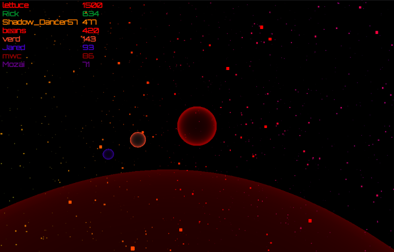

Greetings Zorbians!  Here are our reflections on the recently-completed open alpha preview!

----

If you're new to [Zorbio][zorbio], it's is a web-based 3D eat-em-up currently
in development by [Jared][jared] and [myself][me].  Now, on to the alpha news!

First off, *thank you* to everyone who tried out the game during the open
alpha.  For a game still in alpha, it was really encouraging to see so many
consistent players.  I'd gotten accustomed to only friends and family playing
the game, so seeing total strangers playing at all times of day was *so cool*.

Anyone who would like to continue playing during the upcoming beta development
phase, you'll need an alpha key to play.  Fortunately, they're free, just shoot
an email to [admin@scripta.co][keymail] and we'll send you a key.

Secondly, we're extremely grateful for all the feedback.  The positives and the
negatives both help tremendously.  The feedback was remarkably consistent too,
which gives us a very clear direction going forward into beta development.
We're now acutely aware of Zorbio's weak spots and have designs in place to
shore up those weaknesses.  We also heard loud and clear what everyone liked
about the game, so we can preserve and improve those aspects too!

We hope you'll stick with us through the upcoming beta development and jump on
board when we open things up again.

[zorbio]: http://zor.bio
[keymail]: mailto:admin@scripta.co
[jared]: https://twitter.com/caramelcode
[me]: https://twitter.com/mwcz
