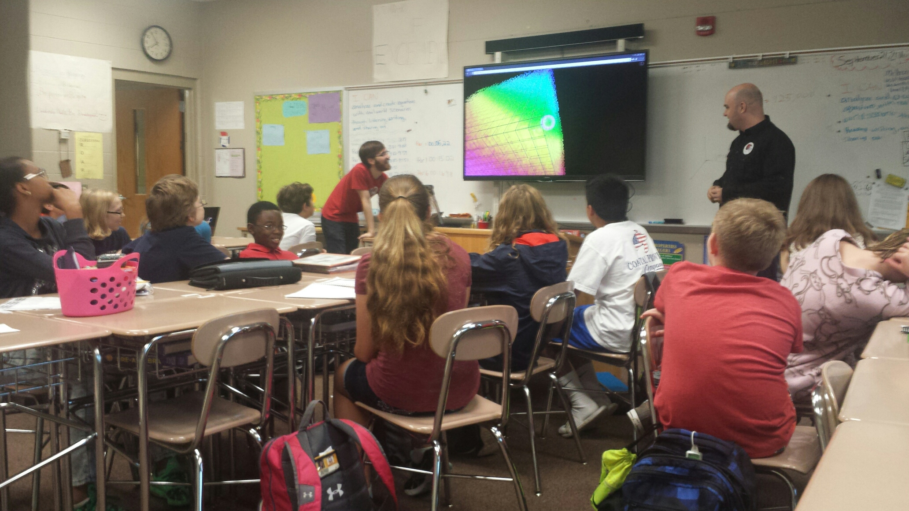
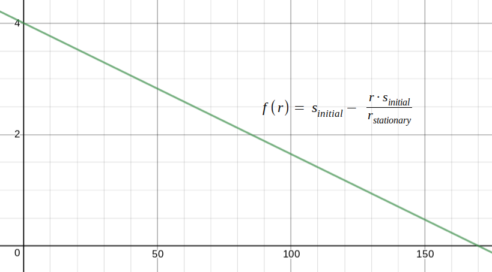

Yesterday, Jared and I visited Moore Middle School.  We spoke to several math
classes about how important math is to creating videogames.

---

We showed the students three equations that we use in [Zorbio][zorbio] to
control various aspects of the game.  We showed how tweaking equations can
cause big changes inside the game.

The students had so many questions that we ran out of time in every class.  We
were incredibly impressed with the students and hope to do more events like
this in the future!

[zorbio]: http://zor.bio
