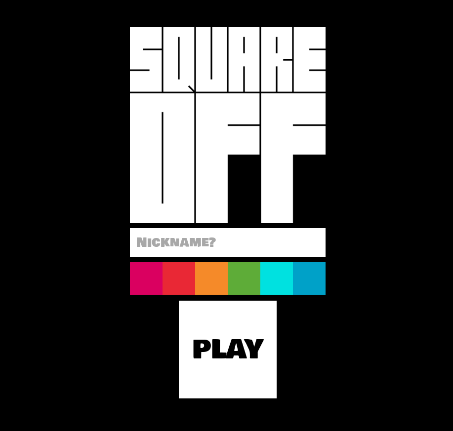
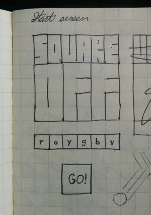
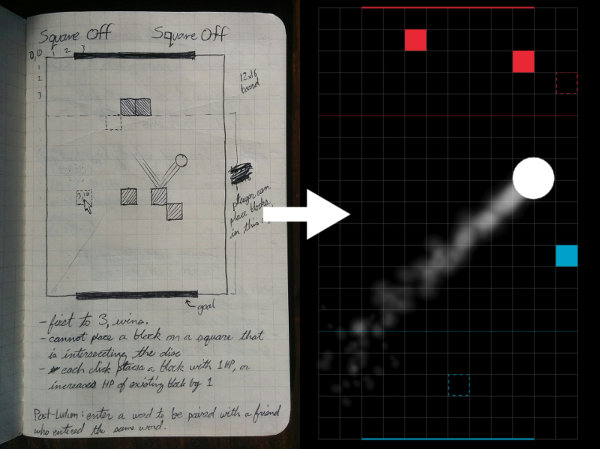
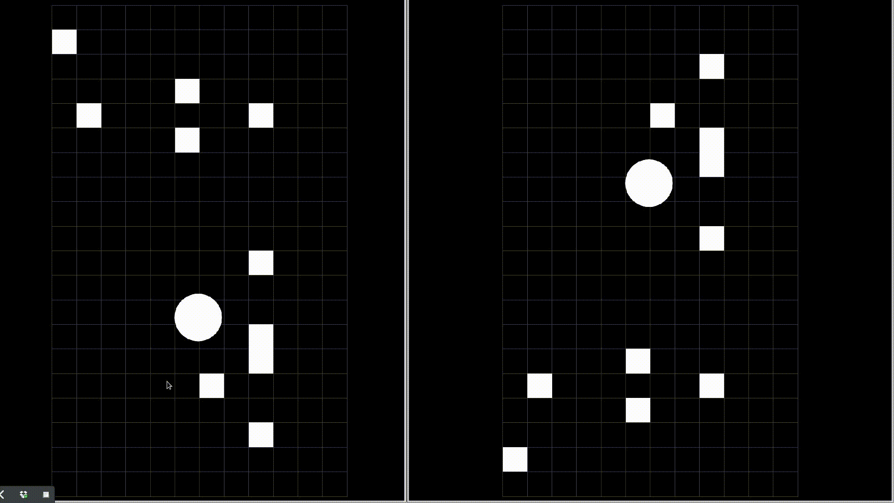
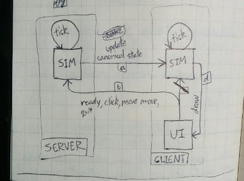
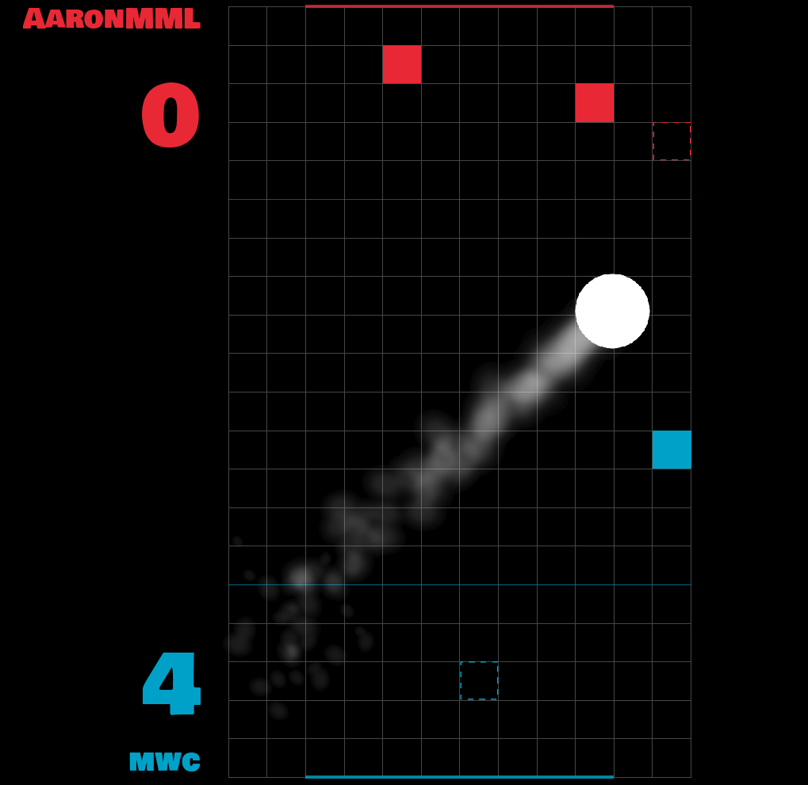
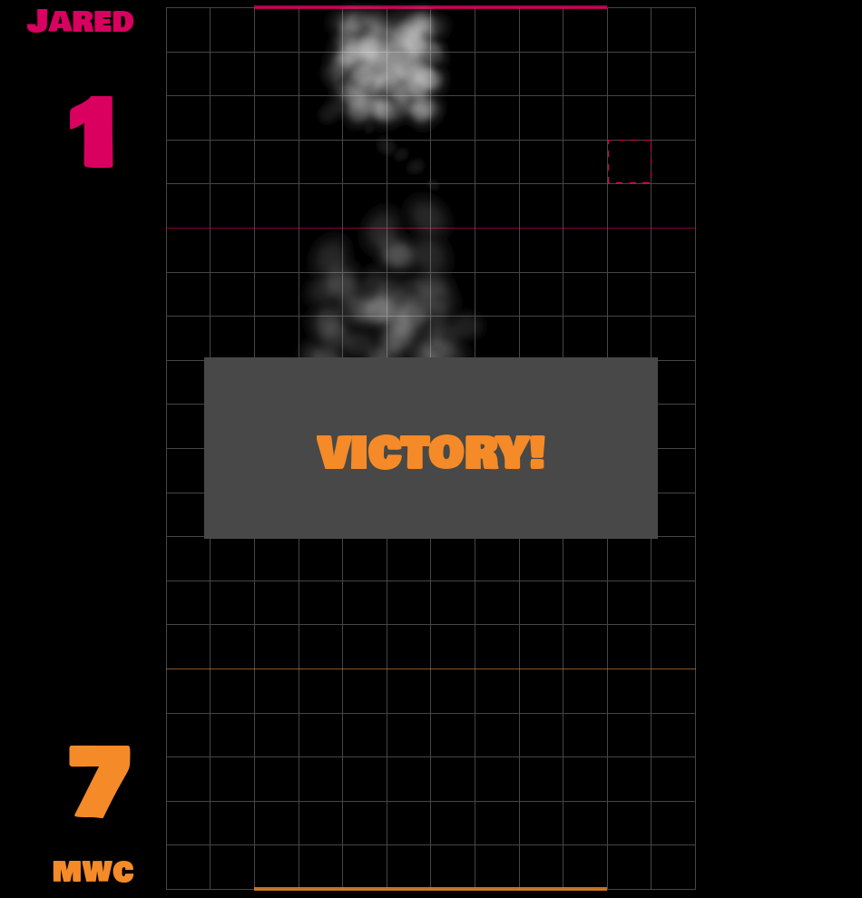

[Jared][jared] and [I][me] participated in our first [Ludum Dare][ld]!  Over
the last weekend, we built a videogame, called **Square Off**, from start to
finish.

But first, [Play it!][sqoff]

----

[Rate it!][ldsq]

[][sqoff]

Ludum Dare is a "videogame jam"; a friendly competition where developers create
a videogame from scratch in just a few days.  Here are some of my first
impressions of the competition:

## Planning

Knowing we'd be under a tremendous time crunch, I sketched out a game idea the
week before.  I expected the concept to change a lot, but weirdly the game
turned out almost exactly like the sketches!

Planning ahead was difficult because Ludum Dare announces the theme at the
start of each competition.  Submissions are encouged to use the theme in their
designs.  This time, the theme was *shapeshifting*.  Unfortunately, we didn't
think of a way to adapt the game to fit the theme, so we went ahead with the
original design.  Fortunately, the theme is optional!

## End of the second day
Here is what the game looked like after the end the second day

## Multiplayer is hard

Multiplayer games seem to be pretty rare in game jams, probably due to the
added complexity.  Creating a multiplayer server is a lot of work, but
more importantly, it's work that the people judging your game can't *see*.

Luckily for us, Jared (the *Server Whisperer*) has a way of bending servers to
his will.  We also relied on a our experience building
[Zorbio](http://zor.bio), also a web-based multiplayer game.

## Don't kill yourself

I wouldn't dream of giving advice after just one Ludum Dare, but I think this
tip stands on its own.

Here's a timeline of our work on the game.  It's pretty tame.  No epic
all-nighters, just three 10~ hour days of solid work, and a couple of small
bugfixes on Tuesday.

The reviews from other Ludum Dare participants have been awesome to read.
Here's one from
[CasualCat](http://ludumdare.com/compo/ludum-dare-35/?action=preview&uid=91982):

> That's pretty awesome! An 1v1 multiplayer game in 72 hours!? The game was
> really fun too, a very innovative take on air hockey. Reaction, strategy,
> tactics, it ran well too! Great game! And it was well polished.

And this one from [BlennosoftGames](http://ludumdare.com/compo/ludum-dare-35/?action=preview&uid=8308):

> Wooo! Such a simple base concept, and yet the competitive strategies got
> quite deep! Much respect to whoever my worthy opponent was (Does it just
> always name your opponent "Jared" or was that really you?), and much more to
> your team for putting this together! 

Those two fine people also submitted some pretty awesome games.

## Retrospective

It was an odd feeling on Monday night when the fog lifted and a new game sat
before us.  The experience was exhilirating and exhausting.  I was
simultaneously happy with the game, and really glad it was over.  For perhaps
the first time, I felt like taking a break from programming for a little while.

Oh, and [view source][source].

[ld]: http://ludumdare.com/compo/
[ldsq]: http://ludumdare.com/compo/ludum-dare-35/?action=preview&uid=91554
[source]: https://github.com/ScriptaGames/SquareOff
[jared]: https://twitter.com/caramelcode
[me]: https://twitter.com/mwcz
[sqoff]: http://sqoff.com/
