During Ludum Dare 37, our second game jam, [Jared][jared] and [I][me] created
Tracer.  Read about how it was made and give it a spin.

[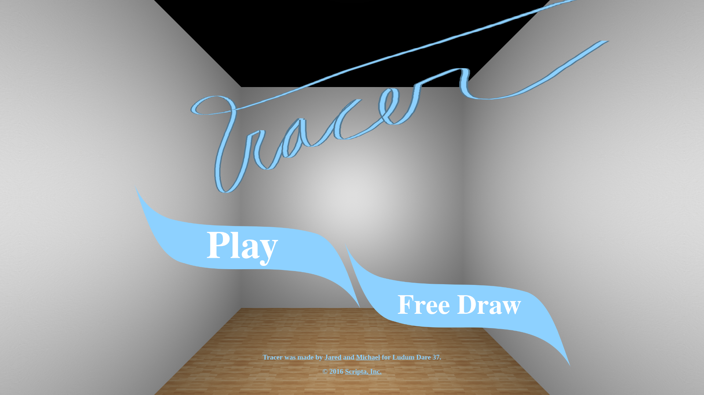][thispost]

----

Tracer was our creation for Ludum Dare 37.  Ludum Dare is a "game jam"; a
friendly competition where developers create a videogame from scratch during a
hairbraned weekend.

I wouldn't blame you if you want to skip all this and go ahead and play the
game...

[Play it!][tracer]

## The idea

First, a bit of backstory.  In our first game, [Zorbio][zorbio] (an *ode to
spheres*), players leave short contrails while flying through space.

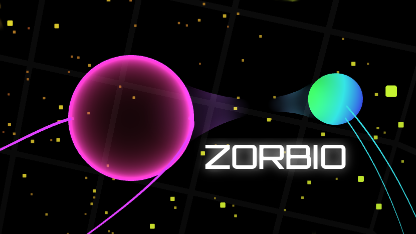

The trails are essentially a weathervane that gives you a visual hint about
where other players are headed.  Short trails suit that purpose, but we found
it irresistable to increase the length of the trails dramatically, just to see
what would happen.  The result, despite not being a good fit for Zorbio, was
*awesome*.  It looks something like this:

We knew there was game potential lurking somewhere in those long, curvy 3D
trails.  A 3D multiplayer lightcycle game perhaps?  Our Ludum Dare 35 game,
Square Off (our *ode to squares*), had been multiplayer, so we knew how much
complexity networking adds to an already tight timeline.

Then Jared had a brilliant idea: **3D connect the dots**.

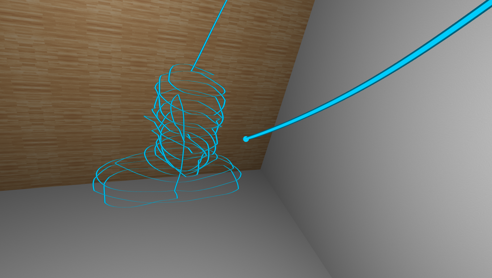

72 hours later, we had a game, which you may now [play][tracer].

You can also [view source][source], if you're into that kind of thing.

## Notes of appreciation

Our thanks to YOU, and also: mr.doob, Cassondra, Jessica, Rowen, Elliott.

Special thanks to Jaume Elias ([@thespite)][thespite]), an
extraordinary real-time graphics programmer.  Two of his projects were
essential for creating Tracer, [THREE.MeshLine][meshline], and an [algorithm
for spiraling through a 3D mesh looking for points][meshspiral].  Jaume is
always an inspiration.  Check out his work at [clicktorelease.com][ctr].

## Development screenshots

Lastly, here's a batch of some mid-development screenshots showing Tracer
during its awkward adolescent phase.

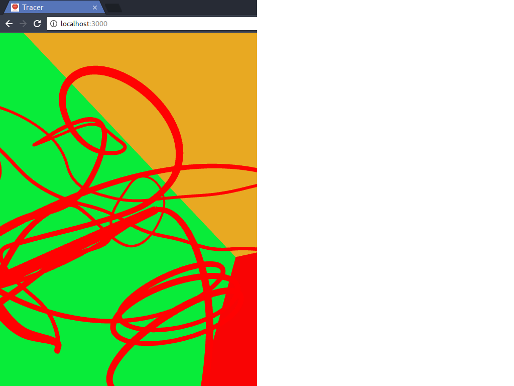

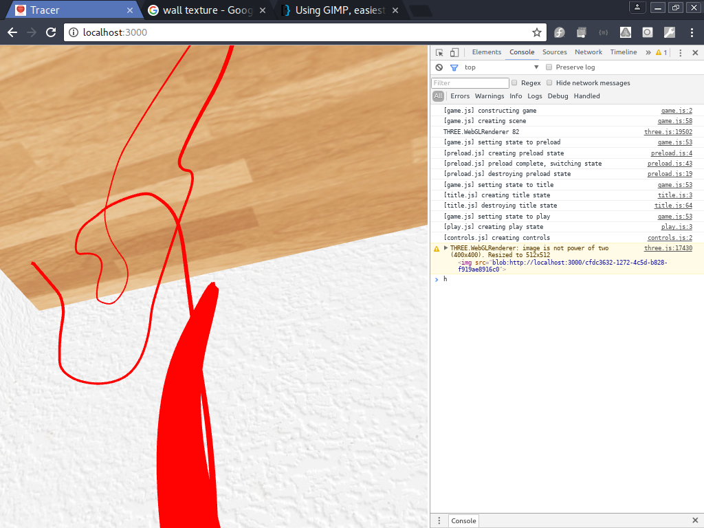

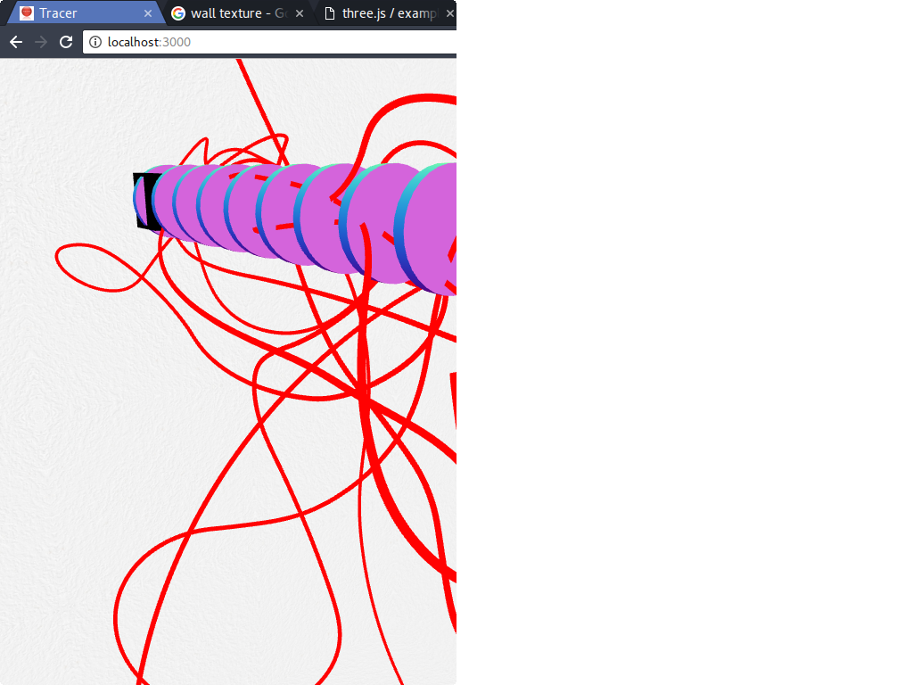

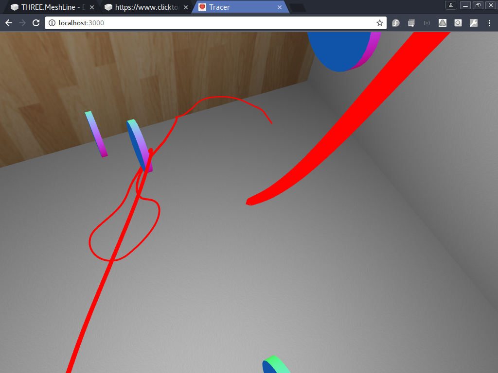

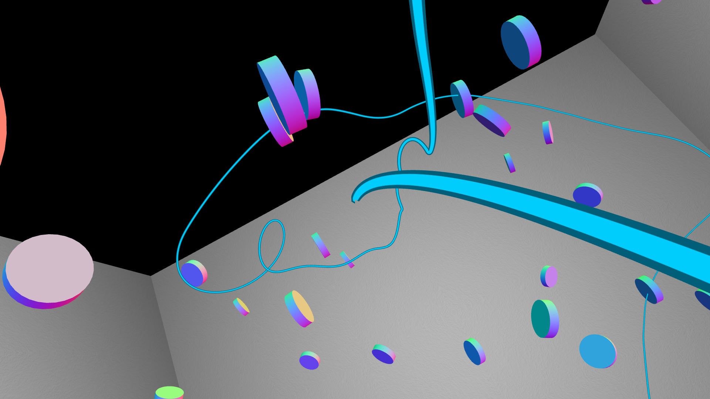

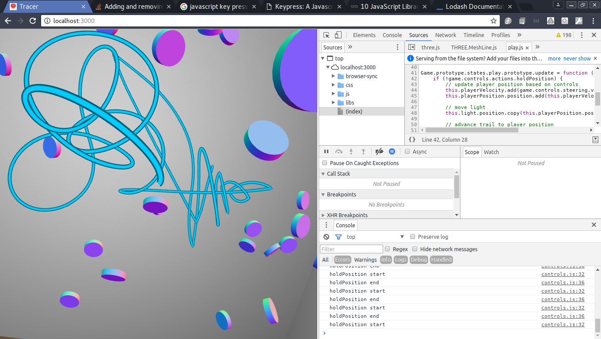

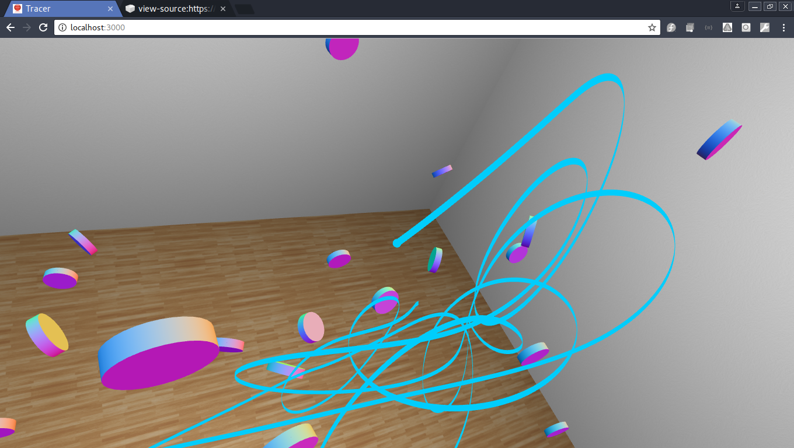

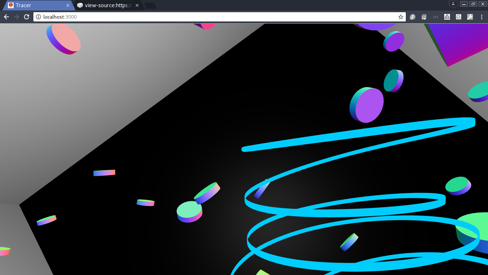

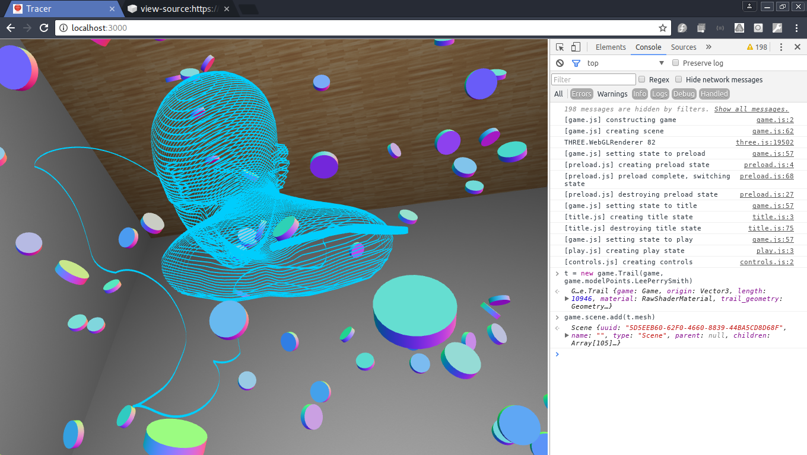

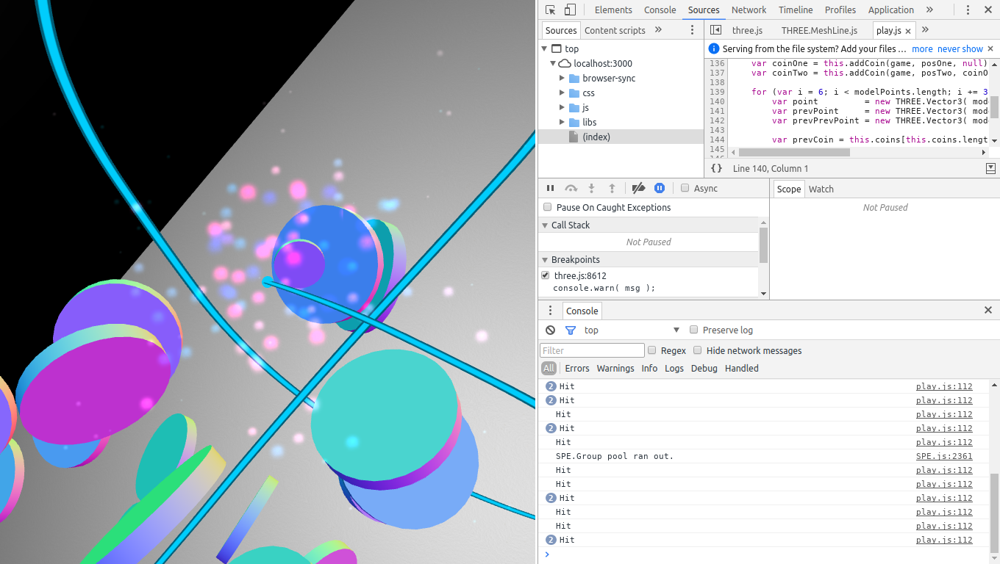

[thispost]: /articles/tracer-ld37/
[ld]: http://ludumdare.com/compo/
[ldtr]: http://ludumdare.com/compo/ludum-dare-37/?action=preview&uid=91554
[source]: https://github.com/ScriptaGames/Tracer
[jared]: https://twitter.com/caramelcode
[me]: https://twitter.com/mwcz
[tracer]: http://scripta.co/tracer/
[zorbio]: http://zor.bio/
[thespite]: https://twitter.com/thespite
[ctr]: https://www.clicktorelease.com/
[meshline]: https://github.com/spite/THREE.MeshLine
[meshspiral]: https://github.com/spite/THREE.MeshLine/blob/master/demo/js/main-shape.js#L90
