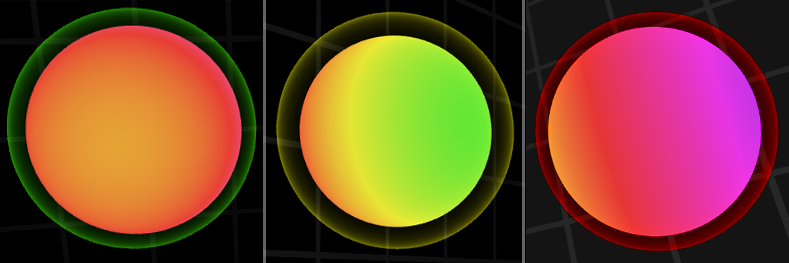

Zorbians, below you will find the patch notes for Zorbio version 1.0.5.

<a href="http://zor.bio">Play Zorbio now!</a>

---

Changelog:

 - Added capture indicators: other players now have a colored ring around
   their spheres which indicate their size relative to your own: 
   
   * Green means you can eat the other player
   * Yellow means you can eat the player, but they're almost as big as you, so
     speed boosting is risky
   * Red means the other player is bigger, be careful!

 - Changes to the drain beam:
   * You gain **bonus mass** when draining a player much larger than you
   * The drain beam's brightness corresponds with the amount of mass being
     drained (this was already the case, but the effect is now more noticeable)
   * Drain beams no longer appear between AI-controlled players

 - Added a loading indicator, which also resolves an issue where the UI would
   appear, but remained unresponsive until the game finished loading

Bugfixes:

 - Fixed several server stability issues
 - Improved [speed infraction checking](https://github.com/ScriptaGames/zorbio-issues/issues/22)

Enjoy the new version!  Share your feedback on
[r/zorbio](https://reddit.com/r/zorbio) or our [Facebook
page](https://facebook.com/zorbio).
