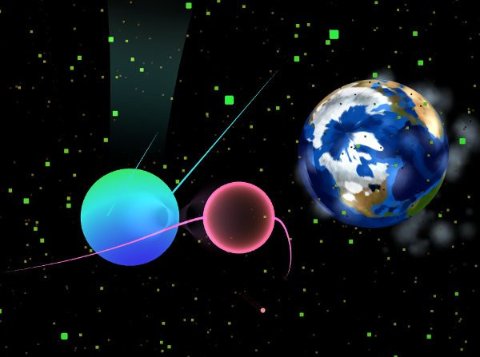

Hello Zorbians!  We are thrilled to present you with the public release of
Zorbio.  If boring change-logs aren't your thing, go ahead and [play it
now](http://zor.bio).

Zorbio is a a web-based 3D eat-em-up.

----

After the Zorbio open alpha seven months ago, we took all the valuable feedback
we received and got to work.  Here are the highlights of all the changes we've
made since then:

Changelog:

 - added speed boost ability!
 - added proximity drain ability!
 - added skins!
 - added trails!
 - added leaderboards!
 - display player name and relative size when aiming at them
 - updated scoring algorithm
 - redesigned game menus
 - redesigned networking code to optimize performance
 - reduced game download size
 - added a setting for choosing steering method
 - game sounds now play in positional 3D (stereo + volume falloff)
 - added size progress bar
 - enabled rapid position updates (from 20hz to 60hz)
 - added a particle burst when capturing a player
 - added AI Spheres (and gave them names!)
 - added setting to hide own trail
 - added growth stages, camera backs up when each stage is reached
 - tweaked the value of food
 - added 'flip x' and 'flip y' settings
 - animate sphere growth
 - optimized food placement and capturing
 - players can no longer spawn on top of other players
 - added speical thanks section to credits
 - updated tutorial

Bugfixes:

 - fixed bug where 'follow' steering angles could be off by up to 40 degrees
 - fixed crash bug in IE 11
 - fixed crash bug in iOS 8
 - fixed capturing player size on respawn screen
 - fixed various sound-related bugs
 - fixed bug where name couldn't be entered on iOS devices
 - fixed server restart message display
 - fixed bug where spheres weren't being removed from scene correctly
 - other, more minor bugs

----

Huge thanks to all our supporters!  You've all got credits embedded in the
game, but also right here:

 - Jessica
 - Cassondra
 - Rowen
 - Elliott
 - Samantha
 - The SCT guys...
 - Wil
 - Josh
 - Matt
 - James
 - Simon
 - molleindustria
 - Moore Square Students
 - Order of The End
 - Josh N.
 - Jessie
 - Dean
 - Carol
 - Logan
 - Fiona
 - Alan
 - Aaron
 - Cousin Jared
 - Spraguelings
 - Red Hat
 - Breddy
 - Sonya
 - Ian
 - West Langley
 - Mr.doob
 - Kahvi Collective (thanks Nik!)
 - All the Alpha testers
 - Everyone else that helped!

----

See you all in the game!
